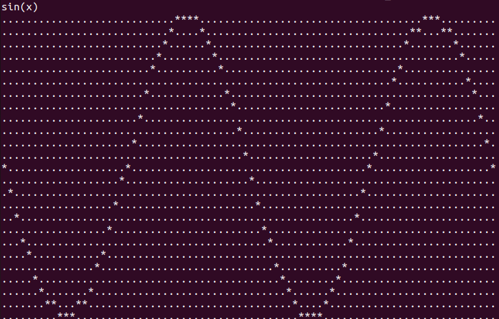

# Console application: Function graph

Here you can find implementation of application which print graph of function using polish notation

## Available operating systems
- macos
- linux

## How to start?

Open your Terminal and print:

    make
    
    ./graph_program

## How to run?

- Print your function without space
 
- In output you will get graph of this function

*Y-axis is pointing down, X value range from 0 to 4Pi, Y value range from -1 to 1 
